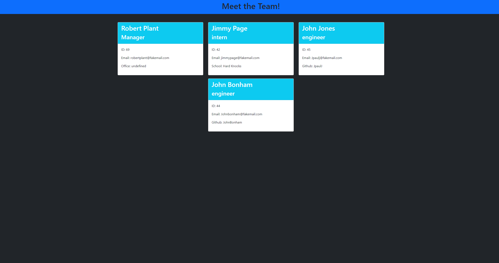

## Portfolio
<pre>
<a href='https://github.com/ZakkFast/atomicKarate'>GitHub Repo</a>
</pre>

### The purpose of the application
<pre>
An app that allows the user to create a Team but answerin question prompts in the console. User can add one Manager and as many Engineers 
and Interns as needed. Once all info is completed the info is populated into an HTML template pre-stylized for your convenience. 
</pre>

### Technologies Used
<pre>
Node.js 
JavaScript 
HTML 
CSS 
Bootstrap Framework 
Jest 
Inquirer 
</pre>

### Requirements/How to
<pre>
Node.js 
Jest 
Inquirer 

Once Node is installed simple run the following commands seperately in your terminal: 
npm init -y
node main

Click the image below to be open a video in another tab for a demo of the application.
</pre>

### Contact

Email: ZakkFastPro@gmail.com 
Twitter: https://Twitter.com/ZakkFast 
GitHub: https://github.com/ZakkFast 